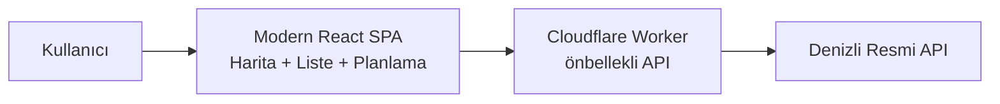

# Ürün Hikayesi

> [!quote] Nasıl başladı?
> Yaklaşık **yedi ay önce**, öğrenci arkadaşlarımın Denizli'nin akıllı ulaşım portalının ne kadar kullanışsız olduğundan şikayet etmesiyle kendime bir soru sordum:
>
> **"Sadece şikayet etmek yerine, bir 11. sınıf öğrencisi olarak bu sistemi baştan yazabilir miydim?"**

Bu sayfa o sorunun yedi ayda dönüştüğü projenin hikayesidir.

---

## Problem

Denizli'nin resmi akıllı ulaşım sistemi zengin ve değerli veriye sahip — ancak bu veriye erişen arayüz:

- Mobilde yavaş ve yoğun.
- Her durakta varış süresini görmek fazla tıklama gerektiriyor.
- "Nasıl Giderim?" özelliği yok; rota planlama mümkün değil.
- Nöbetçi eczane, bakiye dolum noktası gibi pratik şehir bilgileri farklı yerlere dağılmış.
- Çevrimdışı çalışma ya da kartını takip etme yok.

Her gün toplu taşımayla okula giden bir öğrenci için bu "küçük" sorunlar toplamda büyük bir günlük yük demekti.

## Yedi Aylık Yolculuk

Bu benim **ilk büyük çaplı yazılım projemdi**. Yol boyunca karşıma çıkan her engeli *"bunu nasıl çözerim?"* diyerek araştırdım; kelimenin tam anlamıyla **yaparken öğrendim.**

### 1. Tersine Mühendislik ile Başlangıç

Resmi uygulamanın kullandığı veri yolları dokümante değildi. İşe ilk olarak **resmi arayüzün API uçlarını tersine mühendislikle keşfederek ve belgeleyerek** başladım. Her endpoint, her parametre, her yanıt şeması kendi notlarıma girdi.

### 2. İlk Tasarımı Çöpe Atmak

Backend bulunduktan sonra hızlıca bir arayüz taslağı çizdim. Sonra fark ettim: **taslağımın orijinalinden pek farkı yoktu.** Durup modern UI/UX prensipleri üzerine okumaya başladım — tipografi, renk teorisi, bilişsel yük, mobil öncelikli tasarım, erişilebilirlik.

Kendimi hazır hissettiğimde ilk taslağı tamamen sildim ve **kurumsal standartlarda yepyeni bir arayüz** inşa ettim. Bugünkü arayüz o yeniden başlangıcın meyvesidir.

### 3. "Nasıl Giderim?" — Bir Algoritma Serüveni

Orijinal uygulamada yıllardır eksik olan **"Nasıl Giderim?"** özelliğini eklemeyi kafaya koydum. Hayatımda ilk defa **rota planlama algoritmalarını** araştırmaya başladım.

- Önce **Dijkstra** ile tanıştım — klasik ama şehir içi toplu taşımanın zamanlama boyutu için yetersiz.
- Diğer akademik transit routing algoritmalarını inceledim.
- Sonunda senaryoma en uygun olanı seçtim: **McRAPTOR** (Multi-criteria Round-Based Public Transit Routing Algorithm).

RAPTOR'un sıkı matematiksel zarafeti ve düz array'lerle çalışan hafıza dostu yapısı, Cloudflare Workers'ın dar CPU bütçesine kusursuz oturdu. Kod tabanında bu algoritmanın izini bugün hâlâ görebilirsiniz: dataset düz, önceden derlenmiş, `raptor-index.json` olarak yayınlanıyor.

### 4. Gizlilik Dostu Analiz

Şehrin ulaşım ağını anlamaya yardımcı olabilecek hat ve durak yoğunluğu gibi sinyalleri toplamak istedim — ama **kullanıcı gizliliğinden ödün vermeden.** Bu yüzden Google Analytics yerine **self-hosted Umami** kurdum; cookie kullanmaz, kişisel veri toplamaz, yine de bir şehre fayda sağlayacak genel hareketlilik verisini sunar.

### 5. Cloudflare Ekosistemi ile Tanışma

Tüm bu yapıyı Denizli gibi bir şehrin yoğunluğunda ayakta tutabilmek için Cloudflare dünyasıyla tanıştım: **Pages, Workers, KV, Pages Functions**. Service binding'ler CORS problemlerini ortadan kaldırdı ve API'yi gereksiz yere meşgul etmeyen bir mimari kurmama izin verdi.

Sonuç: Sistem bugün tam kapasiteyle çalışıyor, maliyeti **ayda sıfır dolar**.

## Değer Önerisi

Bu katman:

- **Hızlıdır**: Uç bilişim + önbellek ile yukarı akıştan bağımsız ilk yanıtlar sunar.
- **Sadedir**: Kullanıcının tek ekranda ihtiyacı olana odaklanır.
- **Bağlamsaldır**: *"Şu an hangi durakta, hangi otobüs, ne zaman?"* sorusuna bir tıkla cevap verir.
- **Dayanıklıdır**: Yukarı akış geçici olarak çökse bile kullanıcı boş sayfa görmez.
- **Planlayıcıdır**: McRAPTOR sayesinde noktadan noktaya gerçek rota önerisi sunar.

## Kullanıcının Günü

> [!example] Senaryo
> **Ahmet, sabah okula giderken:**
> 1. Uygulamayı açar → favori duraklarını görür (ana sayfa).
> 2. En yakın otobüsün tahmini varış süresini okur.
> 3. Harita sekmesinden canlı konumu doğrular.
> 4. Otobüsü kaçırırsa `/nasil-giderim` ile alternatif rotayı sorgular (McRAPTOR devreye girer).
>
> Hepsi ortalama **3 saniyelik bir ilk yükle**.

## Öne Çıkan Özellikler

| Özellik | Değer |
|---------|-------|
| **Canlı Harita** | Gerçek zamanlı otobüs/tramvay konumları |
| **Durak Detayı** | Durak bazlı, canlı tahmini varış süresi |
| **Hat Detayı** | Hat güzergah çizimi, durak listesi, sefer sıklığı |
| **Nasıl Giderim** | McRAPTOR tabanlı çok modlu rota önerisi |
| **Favoriler** | Sık kullanılan durak ve hatlar |
| **Nöbetçi Eczaneler** | Günlük otomatik güncellenen liste |
| **Dolum Noktaları** | Ulaşım kartı bakiye yükleme noktaları |
| **İstatistikler** | Anonim şehir içi hareketlilik grafikleri |
| **Geri Bildirim** | Tek ekranda kullanıcı geri bildirimi |

## Ürün Değerleri

- **Sadelik**: Her ekran tek bir soruya cevap verir.
- **Hız**: İlk boyalı çerçeve hedef: 1 saniye altı.
- **Erişilebilirlik**: Koyu/açık tema, yüksek kontrast, WCAG AA uyumlu bileşenler.
- **Saygılı gizlilik**: Hesap yok, PII yok, takip yok; sadece cookieless Umami.
- **Yerel**: Arayüz tamamen Türkçe; yerel alışkanlıklar ve terimler korunur.

## Hedef Kitle Araştırması

Proje, gerçek kullanıcı gözlemine dayanır:

- Farklı yaş gruplarındaki yolcuların (özellikle öğrenciler ve ziyaretçiler) günlük rutinlerinin izlenmesi.
- Mevcut portalın kullanılabilirlik zaaflarının kayıt altına alınması.
- Okuldaki arkadaşlardan sürekli geri bildirim alınması.

## Başarı Ölçütleri

| Metrik | Hedef |
|--------|-------|
| First Contentful Paint | < 1 s |
| Time To Interactive | < 2.5 s |
| API ortalama yanıt süresi | < 80 ms |
| Cloudflare Workers CPU / istek | < 10 ms (ücretsiz katman) |
| Aylık altyapı maliyeti | **$0** |
| Kapsanan hat sayısı | %100 şehir ağı |
| Çevrimdışı planlama | Kullanılabilir |

## Hedef

> En büyük hedefim, **baştan sona öğrenerek inşa ettiğim bu projenin Denizli halkı ve öğrenci arkadaşlarım tarafından kullanıldığını**, şehrin ulaşımına gerçekten değer kattığını görmek.

## Devamı

- [[03 Kullanıcı Deneyimi]] — öne çıkan ekranlar
- [[04 Mimari Bakış]] — sistem nasıl kuruldu?
- [[07 Performans ve Ölçek]] — sıfır dolar maliyetle nasıl ayakta kalıyor?
- [[10 Öne Çıkan Yetenekler]] — bu yolculuğun sergilediği yetkinlikler
