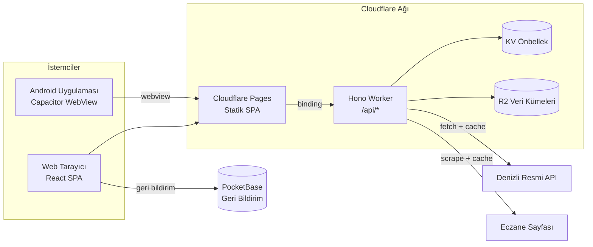
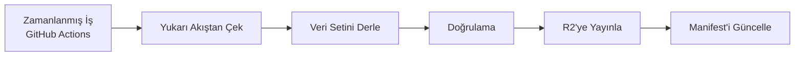
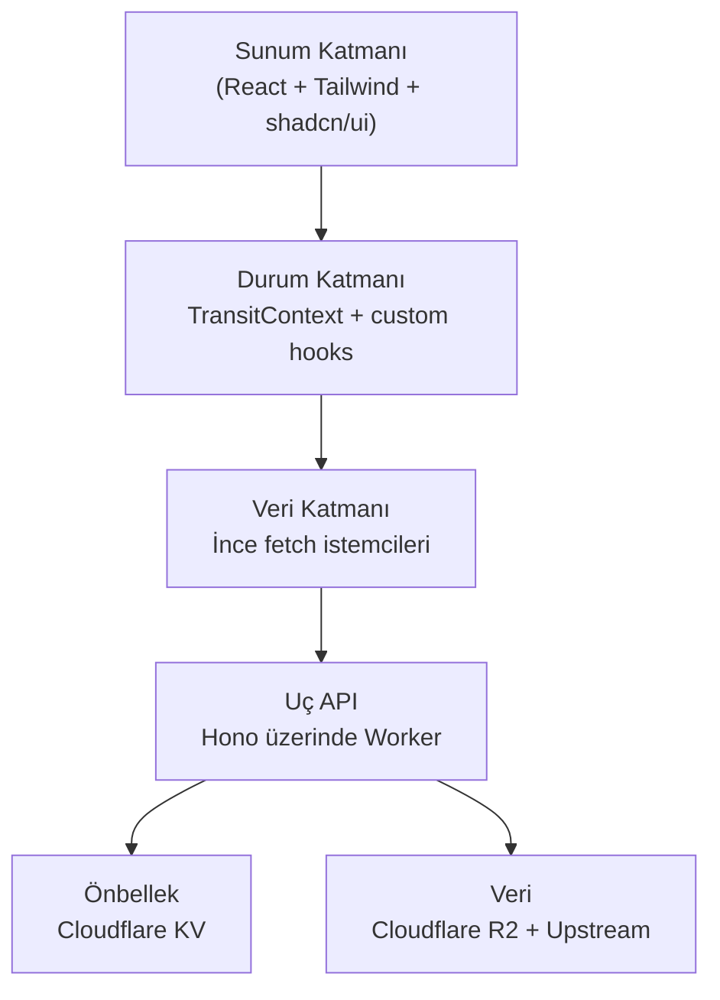

# Mimari Bakış

> [!summary]
> Üç dağıtılabilir birim, bir felsefe: **edge-first**. Cloudflare'ın global ağı üzerinde çalışan ince bir API, gerçek işin çoğunu **önbellek** ve **CI'da derlenmiş veri** ile halleder.

## Sistem Resmi

## Dağıtılabilir Birimler

| Birim | Koşan Yer | Amaç |
|-------|-----------|------|
| Web SPA | Cloudflare Pages | Tüm UI'ı barındırır, CDN ile global servis |
| API Worker | Cloudflare Workers | Resmi API'nin önünde önbellekli uç proxy |
| Android Shell | Play Store hazır APK | Aynı web kodunu native kabukta servis eder |

## Tasarım Kararları (Özet)

### 1. Neden Cloudflare Workers?

- Ücretsiz katmanda küresel uç bilişim.
- Kullanıcı yakınında çalışır → sub-50ms ilk yanıt.
- KV önbellek, R2 nesne depolama ve Pages ile entegre.
- Cold start yok.

### 2. Neden Önbellek Katmanı?

Yukarı akış API'si bazen yavaş, bazen geçici olarak çöküyor. Önbellek şunları sağlar:

- **Hız**: KV okuması mikrosaniyelik.
- **Dayanıklılık**: Yukarı akış çöker, biz çalışmaya devam ederiz.
- **Maliyet**: Çağrı sayısı azalır → kaynak tasarrufu.
- **CPU bütçesi**: 10 ms'lik Workers CPU limiti kolayca karşılanır.

### 3. Neden CI'da Veri Derleme?

Rota planlayıcı için gereken veri kümesi (duraklar, hatlar, geometriler) statik sayılacak kadar yavaş değişir. CI'da günde bir derlenip **R2'ye** yüklenir; Worker çalışma zamanında sadece okur.

### 4. Neden Tek Kod Tabanı (Web + Android)?

Capacitor 8, mevcut web derlemesini Android WebView içine paketler. Avantaj: **UI eşitliği** otomatik.

## Katmanlar

## Ölçeklenebilirlik

- **Yatay**: Cloudflare uç ağı otomatik — yük sunucuya değil, dünyanın her yerindeki edge'e dağılır.
- **Dikey**: Gerek yok; her istek birkaç KB veri ve <10 ms CPU tüketir.
- **Trafiğe dayanıklı**: Yukarı akış yavaşlasa bile cache TTL dolana kadar kullanıcı etkilenmez.

## Dayanıklılık

| Risk | Azaltma |
|------|---------|
| Yukarı akış API çöker | KV'de stale-if-error; kullanıcı eski ama geçerli veri görür |
| CI veri derleme hatası | Önceki manifesti geri alma (rollback) tek tıkla |
| Worker hatası | 500 → JSON yanıt + Cloudflare dashboard'da stack trace |
| Kullanıcı çevrimdışı | Planlayıcı tarayıcı içinde çalışır |

## Güvenlik Duruşu

- Tüm API **public**; kimlik doğrulama yok.
- **PII toplanmaz**; geri bildirim formunda ad/e-posta opsiyonel.
- CORS wildcard (`*`) — API bilinçli olarak topluma açık.
- Feedback endpoint'i IP bazlı hız sınırlaması ile korunur.

## Devamı

- [[05 Teknoloji Seçimleri]] — her katmanda neden bu teknoloji?
- [[07 Performans ve Ölçek]] — 10 ms CPU limiti nasıl karşılanıyor?
- [[08 Güvenlik ve Gizlilik]] — PII'siz tasarımın ayrıntıları
