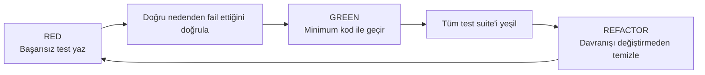

# Mühendislik Kalitesi

> [!summary]
> Projenin omurgası **Test-Driven Development**'tır. Her davranış değişikliği önce başarısız bir test ile yazılır. Üç farklı test ortamı (jsdom + node + `workerd`) + Playwright E2E, CI'da her push'ta koşar. Biome hem lint hem format olarak tek araçta disiplin sağlar.

## Test-Driven Development

Projede **demir kural**: Üretim koduna dokunmadan önce **başarısız bir test** yazılır.



> [!check] Kural kapsamı
> - Yeni özellikler
> - Hata düzeltmeleri (önce hatayı repro eden test, sonra fix)
> - Mevcut kodda davranış değişiklikleri
>
> İstisna: saf yapılandırma düzenlemeleri, atılabilecek prototipler.

## Test Altyapısı

### Vitest Workspaces — Üç Ortam Bir Komut

| Proje | Ortam | Test hedefi |
|-------|-------|-------------|
| `frontend` | jsdom | React bileşenleri ve sayfalar |
| `node` | node | Paylaşılan yardımcılar ve doğrulamalar |
| `backend` | `@cloudflare/vitest-pool-workers` → gerçek `workerd` | Hono route'ları ve servisler |

Backend testleri **gerçek Cloudflare runtime**'ında koşar — production ile %99 eşdeğer.

### E2E — Playwright

- Gerçek tarayıcıda kritik akışlar
- Stublanmış backend (`stubBackend()` fixture'ı)
- Asla gerçek upstream'e dokunmaz

### Yeniden Kullanılabilir Helper'lar

`tests/helpers/` altında:

- `renderWithProviders()` — Router + Context ile React render
- `installUmamiWindow()`, `installLocalStorageWith()` — window/storage stub'ları
- `createMockStorage()` — in-memory depo çiftli
- `stubBackend()` — Playwright için API mock

**Boilerplate yok**: her test aynı altyapıyı yeniden yazmak zorunda değil.

## Sürekli Entegrasyon (CI)

Her PR ve her push'ta `.github/workflows/test.yml` koşar:

1. **Typecheck** — FE + BE `tsc --noEmit`
2. **Unit** — Vitest `frontend` + `node` (kapsama raporu ile) + `backend` ayrıca
3. **E2E** — Playwright chromium

Ayrıca zamanlanmış bir pipeline (`planner-dataset.yml`), rota planlayıcı veri setini her gün yeniden derler ve Cloudflare'a yayınlar.

## Kod Stili — Biome

ESLint + Prettier yerine **tek araç: Biome**:

- 2-space indent, single quotes, semi-colon yok, trailing comma = `all`, 100 kolon genişlik
- Tek komut: `devbox run check:fix`
- Hem linter hem formatter
- Rust'ta yazılmış — saniyeler içinde tüm proje taranır

## Statik Tip Güvenliği

- TypeScript `strict` mode.
- Frontend + backend ayrı `tsconfig.json`; `devbox run typecheck` ikisini de kontrol eder.
- `Env` interface'i Cloudflare binding'lerini tip-güvenli yapar.
- Zod şemaları runtime doğrulamayı tiplerle hizalar.

## Commit Disiplini

- Conventional-ish, imperative İngilizce commit mesajları.
- `.only` / `.skip` komitlenmez.
- `.env` veya keystore asla commitlenmez.
- Kısa ömürlü branch'ler; rebase dostu.

## Gözden Geçirme Kapıları

> [!tldr] "Push etmeden önce" hızlı kontrol
> ```bash
> devbox run typecheck
> devbox run test
> devbox run lint
> devbox run test:e2e    # UI veya API değiştiyse
> ```

CI bu kapıları raporlar ama bloklamaz — sorumluluk geliştiricide.

## Kapsama (Coverage)

- V8 kapsama raporu `frontend` + `node` projeleri için.
- Backend (`workerd`) kapsama V8'in `node:inspector` ihtiyacı nedeniyle kapalı; doğrulama, detaylı assertion'larla sağlanır.
- Rapor: `coverage/` altında HTML + lcov + json-summary.

## Doküman Olarak Test

Bu projede testler **canlı belgedir**:

- Bir özelliğin nasıl kullanılacağını görmek için → teste bak.
- Bir API'nin yanıt şeklini görmek için → teste bak.
- Sharp edge'leri hatırlamak için → teste bak.

## Örnek — Hata Düzeltme Akışı

Bir rate limit hatası rapor edildiğinde:

```bash
# 1. RED — hatayı repro eden test
devbox run test:backend
# (fail)

# 2. GREEN — minimum düzeltme
# backend/src/routes/feedback.ts

# 3. VERIFY
devbox run test:backend && devbox run typecheck

# 4. Commit
```

Test hatayı yakalar, fix test'i geçirir, bir daha bu regresyon olmaz.

## Kalite Sinyalleri

| Sinyal | Değer |
|--------|-------|
| TDD disiplini | Zorunlu |
| Test ortamı çeşitliliği | 4 (jsdom, node, workerd, chromium) |
| CI kapısı | Typecheck + Unit + E2E |
| Lint araç sayısı | 1 (Biome) |
| Tip strict | Evet |
| Bağımlılık versiyonlaması | Kilitli |
| Hayalet dosya yok | `src/components/ui/**` sınırları net |

## Devamı

- [[11 Süreç ve İşbirliği]] — CI ve günlük döngü
- [[10 Öne Çıkan Yetenekler]] — sergilenen mühendislik pratikleri
- [[07 Performans ve Ölçek]] — kalitenin performans boyutu
