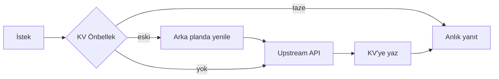

# Performans ve Ölçek

> [!summary]
> Sistem, Cloudflare'ın **10 milisaniye CPU/istek** limitini rahatça karşılayacak biçimde tasarlandı. "Yavaş olabilecek her şey" CI zamanında yapılır; çalışma zamanında yalnızca **KV okuması + çok küçük mantık** kalır.

## Bütçe Kısıtı

Cloudflare Workers ücretsiz katmanında her istek için **10 ms CPU** limiti vardır. Bu bir zayıflık değil, **bir tasarım pusulası**.

> [!warning] Kural
> Hiçbir endpoint 10 ms CPU'yu aşmamalıdır. Yavaşlayan her şey cache'e veya CI'a taşınır.

## Performans Stratejisi

### 1. Uç Bilişim (Edge Computing)

Cloudflare'ın küresel ağı kullanıcının yakınında çalışır. İstanbul'daki kullanıcı, İstanbul PoP'undaki Worker'a ulaşır.

- **Fiziksel mesafe azalır** → ağ gecikmesi düşer.
- **Cold start yok** → ilk yanıt anlıktır.
- **CDN entegrasyonu** → statik varlıklar aynı ağdan servis edilir.

### 2. Agresif Önbellekleme

Her upstream çağrısı bir KV önbelleği arkasına konuldu:

**Stale-While-Revalidate** desenine benzer: kullanıcı her zaman hızlı yanıt alır; veri arka planda tazelenir.

### 3. CI'da Veri Derleme

Rota planlayıcı için gereken tüm şehir verisi (duraklar, hatlar, geometriler) CI'da düz tipli array'lere derlenir:

- **Çalışma zamanı CPU'su**: sıfıra yakın.
- **Integrity hash** ile istemcinin indirdiği veri doğrulanır.
- **Manifest sistemi** ile anlık rollback mümkün.

### 4. Küçük Yüklemeler

- Bundle splitting: harita kodu sadece harita sayfası açılırken yüklenir.
- Tree-shaking: `lucide-react` gibi kütüphanelerden sadece kullanılan ikonlar gelir.
- Brotli sıkıştırma: Cloudflare'da otomatik.

## Ölçek Karakteristikleri

| Metrik | Hedef | Yorum |
|--------|-------|-------|
| Eşzamanlı kullanıcı | ~1M+ | Cloudflare ağında teorik sınırsız |
| İstek/saniye | 10k+ | KV okuması lineer ölçeklenir |
| Ortalama API gecikmesi | < 80 ms | Türkiye içinden |
| Worker CPU/istek | < 10 ms | Free tier uyumlu |
| KV okuma maliyeti | İlk 100k/gün ücretsiz | Ücretli katmana geçmeden uzun ömürlü |

## Gözlemlenebilirlik

- **Cloudflare Dashboard**: Gerçek zamanlı istek/CPU grafikleri.
- **`wrangler tail`**: Production loglarına canlı erişim.
- **Umami (self-hosted)**: Privacy-friendly sayfa görüntüleme analizi.
- **Sentry (opsiyonel)**: Hata takibi için hazır altyapı.

## Dayanıklılık Testleri

| Senaryo | Davranış |
|---------|----------|
| Upstream tamamen çöker | KV'deki son bilgi kullanıcıya servis edilir |
| Trafik ani artar | Cloudflare otomatik ölçekler |
| CI veri derlemesi bozulursa | Önceki manifest kalır; kullanıcı etkilenmez |
| Kullanıcı 3G'de | Küçük payload + sıkıştırma sayesinde kullanılabilir |
| Kullanıcı offline | Rota planlayıcı in-browser çalışır |

## Frontend Performans

### Core Web Vitals

| Metrik | Hedef | Uygulama |
|--------|-------|----------|
| LCP | < 2.5 s | Küçük bundle, critical CSS inline |
| FID / INP | < 200 ms | React 18 concurrent features |
| CLS | < 0.1 | Sabit boyutlu skeleton'lar |

### Lazy Loading

- Sayfa bazlı code splitting (Vite otomatik).
- Harita kütüphanesi sadece harita sayfasında yüklenir.
- Görüntüler lazy.

### Sanallaştırma

Büyük listeler (`Duraklar`, `Hatlar`) için `@tanstack/react-virtual` kullanılarak yalnızca görünen öğeler render edilir.

## Maliyet Analizi

Projeksiyon bazında:

- **Cloudflare Pages**: Ücretsiz (sınırsız istek).
- **Cloudflare Workers**: İlk 100k istek/gün ücretsiz.
- **Cloudflare KV**: İlk 100k okuma/gün ücretsiz.
- **R2**: 10 GB/ay ücretsiz; dataset 10 MB'ın altında.
- **Domain**: Opsiyonel, $10/yıl civarı.

**Toplam tahmini maliyet: yıllık $0-$10 seviyesinde**.

## Devamı

- [[06 Mühendislik Kalitesi]] — performansın test ile doğrulanması
- [[08 Güvenlik ve Gizlilik]] — güvenlik maliyet karşılığı
- [[12 Sayılarla Proje]] — somut sayılar
