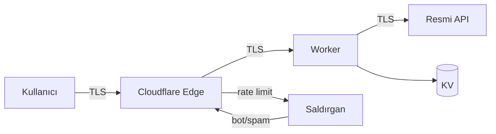

# Güvenlik ve Gizlilik

> [!summary]
> Proje, **"en az yetki + en az veri"** ilkesine göre tasarlandı. Kullanıcı hesabı yoktur; kişisel veri toplanmaz; API herkese açıktır ama yalnızca okuma yapar. Saldırı yüzeyi kasıtlı olarak minimize edildi.

## Güvenlik İlkeleri

1. **Veri toplama**: ihtiyaç yoksa toplama.
2. **Yetki**: en az yetkili kimlik bilgisi.
3. **Bağımlılık**: kaynak güvenilir, versiyon kilitli.
4. **Sır**: repoya asla sızmaz; Cloudflare secrets + dashboard.
5. **Kullanıcı gücü**: kullanıcı bilgisi paylaşmak istemezse uygulama tam çalışır.

## Veri Akışı — Kullanıcıdan Ne Alınıyor?

| Veri | Kaynak | Saklama | Amaç |
|------|--------|---------|------|
| Konum (opsiyonel) | Tarayıcı/cihaz | İstemcide; asla sunucuya gönderilmez | "Yakınımdaki duraklar" özelliği |
| Favoriler | Kullanıcı seçimi | `localStorage` (cihazda) | Favori durak/hat listesi |
| Ulaşım kartı numarası | Kullanıcı girişi | `localStorage` (cihazda) | Bakiye sorgulama kolaylığı |
| Geri bildirim mesajı | Form | PocketBase | Hata/öneri yönetimi |
| Ad/e-posta (opsiyonel) | Geri bildirim formu | PocketBase | Yanıtlama (gerekirse) |

> [!check] Sunucuya yükümlülük yaratacak hiçbir veri zorunlu değil
> Kullanıcı konumunu, adını, e-postasını, kart numarasını paylaşmak zorunda değildir. Hiçbiri paylaşılmazsa uygulamanın temel özellikleri çalışmaya devam eder.

## Kullanıcı Hesabı Yok

- Kayıt yok.
- Parola yok.
- Oturum yönetimi yok.
- JWT yok.

Bu, **kimlik doğrulama saldırılarının tamamını ortadan kaldırır**: credential stuffing, session hijacking, XSS tabanlı token çalma, vb.

## Ağ Güvenliği

| Katman | Önlem |
|--------|-------|
| **Transport** | TLS 1.3 (Cloudflare otomatik) |
| **CORS** | Wildcard (`*`) — API kasıtlı olarak halka açık |
| **Rate Limiting** | Geri bildirim endpoint'inde IP bazlı |
| **Güvenlik başlıkları** | `public/_headers` ile Cloudflare Pages üzerinden |

## KVKK / GDPR Uyumluluğu

Proje gizliliği veri minimizasyonu ile çözer:

- **Kişisel veri toplanmıyor** → GDPR Article 5 (1)(c) "data minimisation" otomatik karşılanıyor.
- **Üçüncü taraf takibi yok** — sadece self-hosted Umami (cookieless).
- **Kullanıcı silme hakkı** — zaten veri yok.
- **Çerez** — sadece Cloudflare'ın teknik çerezleri.

## Analitik — Privacy-First

Google Analytics yerine **self-hosted Umami** kullanıldı:

- Cookieless.
- Kişisel veri toplanmaz.
- Yalnızca toplam sayfa görüntüleme verisi.
- Ortam değişkeni (`VITE_UMAMI_ENABLED`) ile kapatılabilir.

## Bağımlılık Güvenliği

| Önlem | Nasıl |
|-------|-------|
| Versiyon kilitlemesi | `package-lock.json` committed |
| Sürüm güncellemeleri | Periyodik olarak `devbox run install:all` + test suite |
| Güvenlik taraması | GitHub Dependabot alerts |
| Bağımlılık felsefesi | Az sayıda, iyi bakılan, olgun kütüphaneler |

## Sır Yönetimi

- `.env` dosyaları gitignore'da.
- `.env.example` committed; sadece değişken isimleri.
- Backend secrets: `npx wrangler secret put` ile Cloudflare'a.
- Frontend `VITE_*`: build-time public; **hiçbir zaman gizli bir şey içermez**.
- Android keystore: repoda değil; dışarıda saklanır.

## Saldırı Yüzeyi

Proje basit kalarak yüzeyi küçük tutar:

| Saldırı türü | Uygulanabilir mi? |
|--------------|-------------------|
| SQL Injection | Veritabanı yok |
| XSS | React otomatik escape; `dangerouslySetInnerHTML` kullanılmıyor |
| CSRF | Durum değiştirici yetkili istek yok |
| SSRF | Backend sadece sabit bir upstream'e çıkıyor |
| IDOR | Kullanıcı kaynağı yok |
| Session hijacking | Oturum yok |
| Man-in-the-middle | TLS 1.3 her yerde |

## Tehdit Modeli (Kısaca)

## İnce Ayrıntılar

- **Robots meta** — istenmeyen tarayıcı davranışı engellenir.
- **Subresource Integrity** — harici scriptler için hash doğrulaması.
- **CSP (hazırlık)** — Content Security Policy için altyapı mevcut.

## Devamı

- [[04 Mimari Bakış]] — sistem topolojisi
- [[06 Mühendislik Kalitesi]] — güvenliğin test edilmesi
- [[10 Öne Çıkan Yetenekler]] — güvenlik disiplininin sergilenmesi
