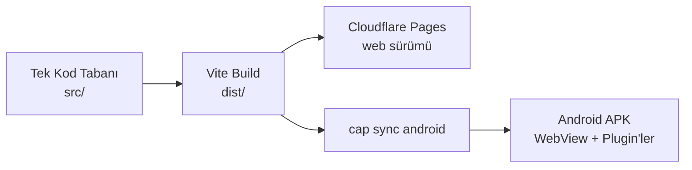

# Mobil Deneyim

> [!summary]
> Android uygulaması, web sürümünün Capacitor 8 ile paketlenmiş versiyonudur. Tek kod tabanı, iki platform — UI eşitliği otomatik. Native yetenekler (konum, paylaşım, bildirim, haptik) plugin'ler aracılığıyla kullanılır.

## Yaklaşım — Tek Kod Tabanı

Seçim: **paralel native uygulama yazmak yok**. Bunun yerine:



**Sonuç**: Web'de yaptığım her iyileştirme bir sonraki APK build'inde otomatik var olur.

## Kullanılan Capacitor Plugin'leri

| Plugin | Amaç |
|--------|------|
| `@capacitor/app` | Uygulama yaşam döngüsü, geri tuşu |
| `@capacitor/browser` | Dış bağlantıları in-app browser ile açmak |
| `@capacitor/clipboard` | Panoya kopyalama (örn. durak adresi) |
| `@capacitor/geolocation` | "Yakınımdaki duraklar" için konum |
| `@capacitor/haptics` | Dokunsal geri bildirim |
| `@capacitor/keyboard` | Klavye olayları, layout |
| `@capacitor/local-notifications` | Bakiye düşük uyarısı |
| `@capacitor/network` | Çevrimdışı durum algılama |
| `@capacitor/preferences` | Cihazda küçük kalıcı KV |
| `@capacitor/share` | Native paylaşım menüsü |
| `@capacitor/splash-screen` | Açılış ekranı |
| `@capacitor/status-bar` | Durum çubuğu renkleri (tema ile senkron) |

## Progressive Enhancement

`src/lib/capacitor.ts` native runtime'ı tek bir yerden soyutlar:

```ts
if (isNativePlatform()) {
  // native-only özellikler
}
```

- **Web'de**: temel özellikler + Web API'ları.
- **Android'de**: aynı özellikler + native zenginleştirmeler (haptik, bildirim, native share sheet).

Bu, **web derlemesinin her zaman bağımsız çalışmasını** garanti eder.

## Build Pipeline

Devbox script'leri ile tek komutlu:

```bash
# Debug APK
devbox run workflow:apk

# Release APK (imzalanmamış)
devbox run workflow:apk:rel
```

Arkadaki adımlar:

1. `build:front` — Vite ile web derlemesi.
2. `cap:sync` — `dist/` → `android/app/src/main/assets/public/`.
3. `android:debug` veya `android:release` — Gradle ile APK.

Tüm pipeline **Android Studio gerektirmeden** terminalden çalışır.

## Çevrimdışı Destek

Android kabuğu, tarayıcının asla yapamayacağı kadar iyi bir çevrimdışı deneyim sunar:

- Uygulama varlıkları WebView içinde zaten yerel.
- `@capacitor/network` ile bağlantı durumu algılanır.
- `src/lib/offline-route-planner.ts` cihazda çalışan tam planlayıcı barındırır — internetsiz rota önerileri mümkün.

## Mağaza Hazırlığı

APK'nın Play Store'a yüklenebilir olması için:

- `compileSdk 36` / `targetSdk 36` (Android 14+).
- Splash screen + icon seti tasarlandı.
- Release APK için imzalama akışı dokümante edildi (`docs/mobile/Android Shell`).
- Privacy policy şablonu hazır.

## Performans

- WebView üzerinden çalışsa da, SPA zaten küçük ve önbelleklidir.
- İlk açılış sonrası tüm statik varlıklar yerelde.
- Harita sayfası sadece gerektiğinde yüklenir (code splitting).

## iOS Olasılığı

Capacitor aynı zamanda iOS desteğine sahiptir. İstenirse:

- `npx cap add ios` ile başlangıç projesi oluşur.
- UI kod tabanı aynı — ek iş yükü CI/CD ve imzalama süreçleri.

Şu an scope dışı, ama **opsiyon açık**.

## Karar Ayrıntısı

Bu mimari kararın detayı için: `docs/decisions/ADR-003 Capacitor Android Shell.md`.

## Devamı

- [[05 Teknoloji Seçimleri]] — Capacitor kararının arkasındaki gerekçeler
- [[04 Mimari Bakış]] — mobil kabuk bütüne nasıl oturuyor
- [[10 Öne Çıkan Yetenekler]] — mobil geliştirme yetkinlikleri
